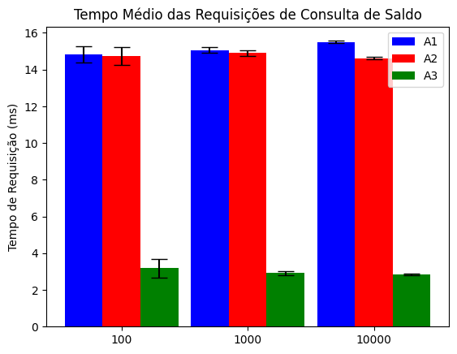

# Financial Application

O objetivo desse repositório é demonstrar maneiras escaláveis de calcular saldo para aplicações financeiras.

Para isso, foi desenvolvido uma API Rest em Node.JS com três abordagens e foi hospedado na AWS.

Em cima dessa API, foi rodado uma suíte de testes de carga, coletado as métricas e foram plotadas usando Python.
---
## Desenvolvimento

A API possui essas rotas que são documentadas via Swagger:
```
POST /users
POST /login
POST /v1/transactions
GET  /v1/balance
POST /v2/transactions
GET  /v2/balance
POST /v3/transactions
GET  /v3/balance
```

O modelo do banco de dados é o seguinte:


Os testes de integração foram executados usando o [k6](https://k6.io/), simulando 50 mil transações. A cada transação criada pelo usuário, ele consultava seu saldo. O arquivo de saída mostra o tempo de requisição para cada requisição.
```
k6 run test.js --out json=<filename>
```

O resultados dos testes foi salvo no Google Drive e a tratativa das métricas foi feita usando `numpy` e `matplotlib`, no notebook [FinancialApplication.ipynb](./results/FinancialApplication.ipynb) (via Google Collab).

- [Resultados](https://drive.google.com/drive/folders/1ESyxlwE1yFEubLzu7r6yA98WM9SK-TlM?usp=sharing) (853Mb)

---
## Abordagens
### V1 - Cálculo Síncrono em Momento de Requisição
A primeira abordagem é a mais simples e mais direta. Toda vez que um usuário solicita seu saldo, é rodado uma query no banco de dados que retorna a soma de todas suas transações.


### V2 - Cálculo Síncrono com Saldo Armazenado
A segunda abordagem não atende as regras de normalização de banco de dados, em vista de conseguir um melhor tempo de leitura. Toda vez que uma transação é criada, seu valor é somado a um campo no banco de dados. Quando um usuário solicitar seu saldo, seu valor já estará calculado.


Apesar de conseguir um melhor tempo de leitura, o tempo de escrita é maior, visto que são necessários pelo menos duas querys ao banco de dados para inserir uma transação.
### V3 - Cálculo Assíncrono com Cache
A terceira abordagem utiliza de processamento assíncrono e cache para conseguir melhores tempos de leitura, sem afetar consideravelmente o tempo de escrita. Toda vez que uma transação é criada, uma mensagem é enviada para outro módulo que fica responsável somente por atualizar o saldo. Quando um usuário solicitar seu saldo, seu valor já estará calculado e armazenado em cache, que possui um tempo de leitura muito menor que um banco de dados relacional.


A principal vantagem dessa abordagem é possibilitar a expansão de funcionalidades sem acrescentar ao tempo de execução. Se a aplicação recebesse novas funcionalidades de notificação ao celular e por email, por exemplo, bastaria que novas filas e módulos escutassem essa mensagem e processassem assíncronamente. As filas podem ter DLQs para mensagens que falham e podem ter controle de TPS e de ordem (Fifo), o que permite a aplicação escalar muito sem causar problemas.


---

## Resultados




## Referências
- Designs - https://cacoo.com/diagrams/22Y1vQdEak76oOeM/EE1A6